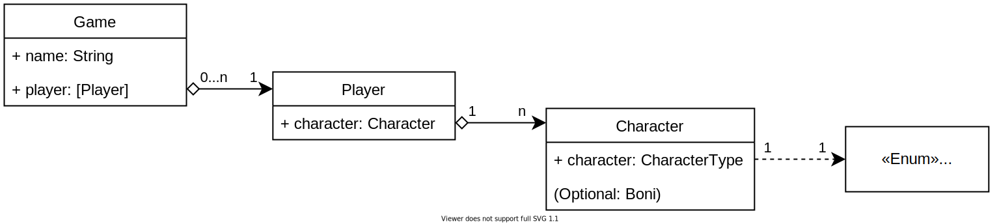
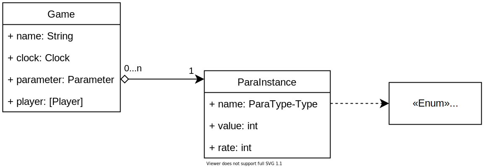

# Object relational mapping

This document gives you an high-level insight into the ORM powering the backend.

## Players and Characters

At the heart of the ORM lays a `Game` object. It is used to differentiante between multiple game instances as well as being the "glue" inbetween the other objects.
Every `Game` can have multiple `Player` objects (representing actual humans playing the game) while a `Player` can only be part of one `Game`. It is thereby a One-To-Many (n:1) relation. We did not take action to prevent humans from having multiple `Player` instances. 
Each `Player` has a `Character` (i.e. Pilot), while each `Character` posseses arbitrary amount of bonus and penalty. Its there by logical to have small, fixed set of `Character`-classes and form a Many-To-One (don't be confused! One-To-Many and MTO are the same thing, just from diffrent viewpoints) relationship to the `Player`, so that every `Player` has exactly one `Character` but every `Character` may have multiple `Player`. Since there can only be one and exactly one "Pilot"-Class in the game, the `CharacterType` attribute is set to be unique. In conjunction with the `CharacterType-Enum`, this achives the desired behavior.

## The Clock

Each `Game` needs a `Clock` which defines how fast-pacted the game is. Since one `Clock` will always belong to only one `Game`, a One-To-One relation is appropriate. The thought to "re-use" `Clock`s by making them One-To-Many is not correct. When one `Clock` is used by multiple `Game`s, they would all run at the same speed (desired behavior), how ever, stopping/pausing one `Game` would then also stop all other `Game`s. Which is not okay.
One could argument to move the `Clock` into the `Game`-Object all together, how ever, this "feels" odd to the end user, when creating a new Game. This could be hidden by a nice UI but would need extra work. Using a OTO relation show the logical connection while maintaining a "pretty feeling" distance. But thats an argue about taste. 

## Parameter

The `Parameter` are one the most essential parts of the app. Their value is the reason for certain action by the user and they can also be the reason for a Game-Over. By the nature of these `Parameter`, they all work the same and are only having a diffrent name. This is why the Enum `ParameterType` is used. Each `Parameter` belongs to one `Game`, thereby forming a Many-To-One relationship. It is possible to instanciate the same `ParameterType` multiple times. It has to be, to allow multiple `Game`s simultaneously.

